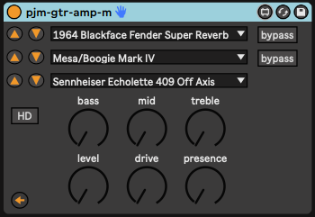

pjm-gtr-amp-m - Max for Live device wrapper for the **Waves GTR Amp (m)** audio plugin 
================================================================================

**UNDER CONSTRUCTION**

This is a Max for Live Audio Effect device. It is a wrapper over the 
**Waves GTR Amp (m)** plugin, which you must already have installed on
your system.

The **Waves GTR Amp (m)** plugin is one of the plugins available 
in **[Waves GTR3 Amps][]**.  Which you can only obtain via a bundle that
includes it, such as **[Waves GTR3][]**, currently the cheapest option.  I
got it for $30.

**Waves GTR3 Amps** contains more amp plugins than the one provided here, 
but they seem to just allow you to combine multiple cabs or amps or 
something.  Doesn't seem worth doing, to me - just use this wrapper more
than once on the same input :-)

**Waves GTR3** contains a bunch of other plugins like stomp boxes.  Meh.
Just use whatever you're using today, or builtin to Ableton.

Feel free to copy this code to make wrappers for any of that though!

[Waves GTR3 Amps]: https://www.waves.com/plugins/gtr3-amps
[Waves GTR3]:      https://www.waves.com/plugins/gtr3

controls
--------------------------------------------------------------------------------

The top three "lines" of the plugin control the amplifier, cabinet,
and microphone.  You can select from the list, or use the arrow buttons
to the left of the list to cycle up and down the list - useful to assign
to foot switches for previewing.  The amplifier and cabinet also have
bypass toggles beside them.

The bass, mid, treble, level, drive and presence do what you would
expect.  The "master" button in the Waves UI is referred to as "level"
here.

The HD toggle turns High Definition on/off.

Lastly, the arrow button on the bottom left will open the plugin
window.  This can be useful to browse presets.

Currently, some of the controls in the actual plugin window (opened with
the arrow button mentioned above) will be reflected in the wrapper.  The
ones that won't are the amp / cab / mic pickers.  This should be do-able,
but deferring for now.  This will end up making playing with presets in
the actual device useless, if you wanted to save the values in the Live
effect.

install
--------------------------------------------------------------------------------

Download the [latest version](https://github.com/pmuellr/pjm-gtr-amp-m/archive/refs/heads/main.zip).

Extract the contents of the archive, and drag the `*.amxd` file to your 
User Library.  Or whatever it is you do with your `*.amxd` files.

details
--------------------------------------------------------------------------------

VST parameter number, parameter names, with associated Waves name:

| param  | pjm name           | Waves name |
|--------|--------------------|------------|
|    1   | bypassAmp          | Amp Bypass |
|    2   | bypassCab          | Cabinet Bypass |
|    3   | amp                | Amp Type |
|    4   | drive              | Drive |
|    5   | bass               | Bass |
|    6   | mid                | Mid |
|    7   | treble             | Treble |
|    8   | presence           | Presence |
|    9   | cabinet            | Cabinet 1 |
|   10   | level              | Level |
|   11   | mic                | Microphone 1 |
|   12   | -na-               | Amp Type Popup |
|   13   | -na-               | Cabinet 1 Popup |
|   14   | -na-               | VU |
|   15   | -na-               | Microphone 1 Popup |
|   16   | -na-               | Back |
|   17   | -na-               | Forward |
|   18   | -na-               | HD |

Auto-mapped parameters are available as controls in the following banks:

| bank  | ctl 1     | ctl 2     | ctl 3     | ctl 4     | ctl 5     | ctl 6     | ctl 7     | ctl 8     |   
|-------|-----------|-----------|-----------|-----------|-----------|-----------|-----------|------------
|    1  | amp       | cab       | mic       | drive     | presence  | bass      | mid       | treble    |
|    2  | amp +1    | amp -1    | cab +1    | cab -1    | mic +1    | mic -1    | bypassAmp | bypassCab |

All of the parameter mappings for amp, cab, mic are in [params.md](params.md)

changelog
--------------------------------------------------------------------------------

version 2023.02.09

- initial version