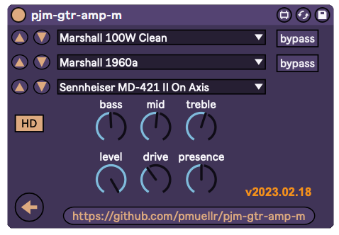

pjm-gtr-amp-m - Max for Live device wrapper for the **Waves GTR Amp (m)** audio plugin 
--------------------------------------------------------------------------------

**UNDER CONSTRUCTION**

This is a Max for Live Audio Effect device. It is a wrapper over the 
**Waves GTR Amp (m)** plugin, which you must already have installed on
your system.

The **Waves GTR Amp (m)** plugin is one of the plugins available in the 
[Waves GTR3 Amps package][] from Waves.  Which you can only obtain via a 
bundle that includes it, such as [Waves GTR3 package][], currently the
cheapest option.

[Waves GTR3 Amps package]: https://www.waves.com/plugins/gtr3-amps
[Waves GTR3 package]:      https://www.waves.com/plugins/gtr3

usage
================================================================================

Download the [latest version](https://github.com/pmuellr/pjm-gtr-amp-m/archive/refs/heads/main.zip).

Extract the contents of the archive, and drag the `*.amxd` file to your 
User Library.  Or whatever it is you do with your `*.amxd` files.

details
================================================================================

The Link Gains, Envelope Type, and Envelope Response controls are the
toggle buttons under the Output knob.

VST parameter number, parameter names, with associated Waves name:

| param  | pjm name           | Waves name |
|--------|--------------------|------------|
|    1   | bypassAmp          | Amp Bypass |
|    2   | bypassCab          | Cabinet Bypass |
|    3   | amp                | Amp Type |
|    4   | drive              | Drive |
|    5   | bass               | Bass |
|    6   | mid                | Mid |
|    7   | treble             | Treble |
|    8   | presence           | Presence |
|    9   | cabinet            | Cabinet 1 |
|   10   | level              | Level |
|   11   | mic                | Microphone 1 |
|   12   | -na-               | Amp Type Popup |
|   13   | -na-               | Cabinet 1 Popup |
|   14   | -na-               | VU |
|   15   | -na-               | Microphone 1 Popup |
|   16   | -na-               | Back |
|   17   | -na-               | Forward |
|   18   | -na-               | HD |

Auto-mapped parameters as the following banks:

| control 1 | control 2 | control 3 | control 4 | control 5 | control 6 | control 7 | control 8 |   
|-----------|-----------|-----------|-----------|-----------|-----------|-----------|------------
| amp       | cab       | mic       | drive     | presence  | bass      | mid       | treble    |
| bypassAmp | bypassCab | amp -1    | amp +1    | cab -1    | cab -1    | mic -1    | mic -1    |

changelog
================================================================================

version 2023.02.09

- initial version